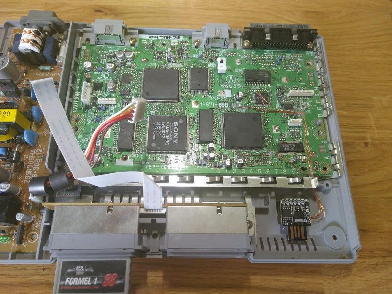

# psx avr modchip
this is the implementation of an Playstation 1 Modchip based on AVR Microcontrolers, 
written in plain C. 



## Introduction
At first I have to say, I'm not a great friend of all the arduino environment out 
there. Don't get me wrong, it's great to make things easier for beginners so
more people get into programming embedded systems like that. But I don't like 
the idea to need a bigger microcontroller just because I'm using the Arduino
library with it's C++ wrapper classes which needs way more space than plain C
and is less performant. Also it seems to be quite common to write the whole code
into one .ino file what I have seen so far, what it makes things quite hard to 
maintain. 

With this background, I searched for an implementation of an Playstation 1 Modchip
based on ATMEL 8bit microcontrollers. The best project I have found so far is
that one from **PSNEE** on [github.com/kalymos/PsNee](https://github.com/kalymos/PsNee). 
The guys did a very well job and a lot of research to create a functional modchip 
based on atmel microcontrollers. So thanks a lot for the inspiration and knowledge!

Like I said at the beginning, I don't like the Arduion IDE with it's C++ wrapper
classes, I saw a challenge to myself to create my own modchip with plain C.

## Features
In this early stage the modchip is only active for a specific time peroid after
the playstation is powered on. This means that the injection to trick the console
is at the moment based on the perfect timing after the power on of the playstation. 

The Pins **SUBQ** and **SQCK** for detecting on which sector of the CD the 
reader (lens) is located, is currently not used! With this method the modchip 
could always detect perfectly when it is needed to inject the region code. 

## Target Hardware
The software is written for the **ATTiny85** but can easily ported to every AVR
Microcontroller. 

If you want to use for example the **ATTIny85 - Digispark Rev.3** board like me, the 
installed bootloader [micronucleus](https://github.com/micronucleus/micronucleus) 
can not be used for this project. The bootloader waits for a certain time after
powerup to give you the chance to upload your code. Only after this timeout the
code on the chip will be executed. The problem here is that the timeout is 
to long and the controller will miss the point when it should perform the injection
to trick the copy protection. So just use a simple ISP Programmer and override
the bootloader. 

## Supported/Tested Playstation
Currently the only Playstation which I own is the **SCPH-7502 (Board PU-22)**, so
at the moment is this the only tested model. But normally all Playstations with
a PU-22 or newer Board should work. 

Please take a look at [Playstation Models](https://en.wikipedia.org/wiki/PlayStation_models)
if youre not sure which Board Version your Playstation may have. 

## Pinout
this is the pinout on the playstation 1 mainboard:

```
    C325 Minus      GND             -> our Ground connection
    C325 Plus       3.3V            -> do not use 5V as supply voltage!

    IC304 Pin24     SUBQ            -> data-line for indication the position of the lens
    IC304 Pin26     SQCK            -> data-clock for SUBQ

    IC732 Pin5      Gate (WFCK)     -> needed for PU22 or newer boards 
                                       (modulatet on the data-line for HIGH-Level)
    IC732 Pin42     Data (CEO)      -> data-line where we inject the region code
```


## How it works
A really good video which shows how the protection works can be found on 
[youtube (Channel: Technology Connections)](https://www.youtube.com/watch?v=XUwSOfQ1D3c)

### Bit-Length
Okay, so now more detailed what we do to trick the copy protection... The 
**Data** Pin expects a stream with 250 bps (Bits-per-second) which contains the
region code. So generally we can say that one Bit must have a pulsewidth of
4ms. So the a stream must look like this example: 


```
       1       0       1       0       0       1  
    _______         _______                 _______
   |       |_______|       |_______________|       |  
   |<-4ms->|<-4ms->|<-4ms->|<-4ms->|<-4ms->|<-4ms->|

```

## Byte-Stream
So now we know how the bits should look like, lets concentrate on the data.
What we want to inject are the different streams depending on your region:
- SCEE for Europe
- SCEA for America
- SCEI for Japan

In the table below are all characters listed to build every region code. 
I think understanding what ASCII codes are is not that hard, so let's focus on 
how the ASCII codes need to be transformed for the playstation data line. 
At first we need to mirror each byte because the playstation reads that stream from 
LSB to MSB and that means we have to start the injection from the 'lowest' to 
the 'highest' bit. In other words: inject from right to left. So fine, that wasn't
that hard, at least we have to invert each Bit an we're done. I'm not sure if 
this is because of the positive/negative wobble-offset on the cd which normally
holds this stream. 

```
    Letter  ASCII-Hex   ASCII-Binary	Backwards       Inverted
    S         0x53      0101 0011	-> 1100 1010    -> 0011 0101
    C         0x43      0100 0011	-> 1100 0010    -> 0011 1101
    E         0x45      0100 0101	-> 1010 0010    -> 0101 1101

    E         0x45      0100 0101	-> 1010 0010    -> 0101 1101
    A         0x41      0100 0001       -> 1000 0010    -> 0111 1101
    I         0x49      0100 1001       -> 1001 0010    -> 0110 1101
```

### Protocol
To complete the how-to we need to talk about the protocol which the playstation
uses. This is pretty simple: there is 1 start bit (High) and 2 stop bits (Low). 
So all we have to do is surround each Byte with a `1` at the beginning an two `0`s 
at the end. So finally, here is the complete injection stream for the European
Playstation:

```
      S                C                E                E
  /       \        /       \        /       \        /       \
1 0011 0101 00   1 0011 0100 00   1 0101 1101 00   1 0101 1101 00
^           ^^
|           ||
|           ||
|           |'----- Stop Bit
|           '---- Stop Bit
|
'----- Start Bit

```

### Model specific stuff
There is a little difference between older boards and the PU-22 and newer, how 
a high-bit on the **Data** line must look. 

For boards **older than PU-22** is nothing special, a high-bit is just high and thats
all. 

```
        ___________             _______________________
Data:  |           |___________|                       |_______________________
       |<--- 1 --->|<--- 0 --->|<--- 1 --->|<--- 1 --->|<--- 0 --->|<--- 0 --->|
 
```

But for **PU-22 and newer**, during a high-bit the **Data** line must have the same
level as the**Gate** line. Let me show it in a Example: 


```
             __      _    _____   __    ___        __   _    _        ___
Gate:   ____|  |____| |__|     |_|  |__|   |______|  |_| |__| |______|   |_____
  
             __                   __    ___        __     
Data:  |____|  |_________________|  |__|   |______|  |_________________________
       |<--- 1 --->|<--- 0 --->|<--- 1 --->|<--- 1 --->|<--- 0 --->|<--- 0 --->|


```


